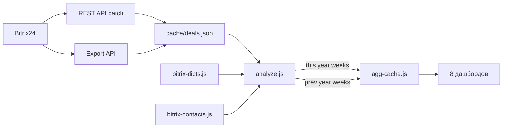

## 🛑 Критическое правило: разрешение перед реализацией

**Перед началом любой реализации (правка файлов, добавление кода, изменение архитектуры) — спрашивать разрешение. У всех. Всегда.**

Не важно, кто пишет — Иван, Ольга или Анастасия. Даже если собеседник не ждёт разрешения и говорит «делай», я всё равно спрашиваю: «можно приступить к реализации?».

Это предупреждает ошибки с моей стороны. Иван и я это понимаем, остальные пусть привыкают.

Порядок действий:
1. Получить задачу
2. Спросить разрешение: «можно приступить к реализации?»
3. Только после явного «да» — начинать править файлы

**Нарушение было 20.06 — я сразу записал инструкцию в MEMORY.md вместо того чтобы сначала показать в чате.**

---

## 🚫 Правило: не додумывать, только прямые указания

**Правки дашборда — только по прямым указаниям Ольги.**
- Не предлагать изменений, не додумывать, не делать лишнего
- Не торопиться
- Если Ольга хочет обсудить — она скажет: «давай подумаем», «как ты думаешь?», «предложи варианты»
- Это работает только в чате (обсуждение идей)
- Все изменения кода/дашборда — только когда Ольга прямо сказала что делать
- Если непонятно — переспросить, а не делать

---

## 🎯 Процесс работы с дашбордами (обновлено 06.07.2026)

При работе с дашбордами:

1. **Обновить данные:** `cd data-service && npm run fetch` (на VPS, из workspace)
2. **Проверить** — что загрузилось, есть ли сделки
3. **Сообщить результат** — что получилось, цифры
4. **Ждать утверждения** — не выкатывать на фронт без ok
5. Правки по обратной связи
6. Утверждение
7. **Обновить кэш:** дашборды с `getAgg()` обновляются с TTL 60с, просто перезапросить страницу
8. Если правил код → `pm2 restart clover-web`
9. Если менял бизнес-правила → `cd data-service && npm test` (проверить что тесты проходят)

**Перед первым запуском после клонирования:**
- Создать `.env` с `BITRIX_BASE` и `SESSION_SECRET` (генерация: `node -e "console.log(require('crypto').randomBytes(32).toString('hex'))"`)
- Опционально `RSHU_YEAR` для фиксации отчётного года

**Пока Ольга / Иван не скажут «делай» / «выкатывай» — ничего на фронт не публиковать.**

---

## 📐 Правило: артефакты и выверка аналитики

**Моя задача — быть компьютером, который считает точно по правилам.**

1. **Выводить артефакты** — все аномалии показывать отдельным блоком:
   - Отрицательная длительность (UF_DATE_PAY_1C < DATE_CREATE) — оплата раньше создания
   - Возвраты (UF_DATE_PAY_1C + LOSE + >0)
   - Сделки с оплатой «в работе» (UF_DATE_PAY_1C + P)
   - WON без UF_DATE_PAY_1C
   - Технические сделки (WON + 0₽)

2. **Проверять данные** — перед каждым отчётом:
   - Все ли сделки соответствуют правилам?
   - Есть ли аномалии, которые искажают картину?
   - Что не стыкуется и рушит логику?

3. **Точность**:
   - Не гадать, не прикидывать — только проверенные цифры
   - Если сомневаюсь — переспросить или показать артефакт
   - Не додумывать логику расчёта

4. **Новые данные** — при каждом обновлении (новый месяц/неделя/сделки):
   - Пересчитать всё по правилам
   - Показать артефакты
   - Указать что не соответствует правилам и требует проверки

---

## 📖 CRM Bitrix24 — Справочник кастомных полей

Создан `CRM_FIELDS_REFERENCE.md` — полный справочник кастомных полей CRM Bitrix24 (COMPANY, CONTACT, DEAL).
Формат: Код | Название | Тип. Обновлён 2026-06-19 из выгрузки crm_fields_*.xlsx.
Смотреть: [CRM_FIELDS_REFERENCE.md](CRM_FIELDS_REFERENCE.md)

---

## 🏗 Архитектура проекта (актуальная, 02.07.2026)

**Проект:** РШУ Дашборды — npm workspaces монолит, единый Express-сервер на порту 3000.
**Сайт:** https://uprav.tech/

```
projects/
├── package.json              # корень npm workspaces
├── .env                      # BITRIX_BASE, SESSION_SECRET, опционально RSHU_YEAR
│
├── data-service/             # ❗ ЕДИНЫЙ СЛОЙ ДАННЫХ
│   ├── index.js              # npm run fetch (5 шагов, ~20-40 мин), writeFileAtomic()
│   ├── analyze.js            # аналитика, читает cache/ + deal-rules.js
│   ├── agg-cache.js          # getAgg() — in-memory кэш с TTL 60с
│   ├── fetch-partial.js      # частичная догрузка
│   ├── test/
│   │   └── deal-rules.test.js # тесты бизнес-правил (npm test)
│   └── lib/
│       ├── bitrix-rest.js    # crm.deal.list через batch API
│       ├── bitrix-export.js  # CRM Export API (секрет: 14b0fc…)
│       ├── bitrix-dicts.js   # справочники (воронки, стадии, источники, пользователи, форматы)
│       ├── bitrix-contacts.js # контакты + компании по ID из сделок (с защитой от None)
│       ├── fetch-modules.js  # даты модулей программ → participants-dashboard
│       └── deal-rules.js     # ⭐ ЕДИНЫЙ МОДУЛЬ БИЗНЕС-ПРАВИЛ (КОМ, оплата, формат, MQL, B2B/B2C)
│   └── cache/                # ❗ генерируется, в .gitignore
│       ├── deals.json         # все сделки (слитые REST + Export)
│       ├── dicts.json         # справочники
│       ├── contacts.json      # контакты
│       ├── companies.json     # компании
│       └── fetched_at.json    # метка времени последней загрузки
│
├── clover-web/               # Express-сервер
│   ├── server.js             # lazy-загрузка 8 дашбордов
│   ├── data/
│   │   ├── users.json        # учётки (ivan, olga, anastasia, Uprav, test_ivan)
│   │   ├── dashboards.json   # реестр 8 дашбордов (label, icon)
│   │   └── sessions/         # FileStore сессий
│   └── public/
│       ├── shared.css        # единые стили (design system)
│       └── shared.js         # ⭐ общие фронтенд-хелперы (api, fmt, escapeHtml, initTableSort, BASE_PATH)
│
└── dashboards/               # 8 дашбордов
    ├── rshu-management-dashboard/   # ⭐ Управленческий — главный
    ├── participants-dashboard/      # Участники
    ├── ratings-dashboard/           # Рейтинги
    ├── kom-dashboard/               # КОМ
    ├── rshu-dashboard/              # РШУ (базовый отчёт)
    ├── drop-dashboard/              # ДРОП (отчёт по продажам)
    ├── test-dashboard/              # Тестовый (прогноз мотивации)
    └── manager-report-dev/          # Отчёт для менеджеров
```

### Пайплайн данных



**Шаги `npm run fetch` (последовательно):**
1. `bitrix-rest.js` — REST API crm.deal.list → все сделки (batch-запросы)
2. `bitrix-export.js` — Export API → старые сделки без STAGE_SEMANTIC_ID + мерж
3. `bitrix-dicts.js` — воронки, стадии, пользователи, форматы, направления
4. `bitrix-contacts.js` — имена контактов и компаний (CONTRACT_ID, COMPANY_ID)
5. `fetch-modules.js` — даты модулей программ → participants-dashboard

**Аналитика (`analyze.js`):**
- Читает `cache/deals.json` + справочники
- Возвращает понедельные агрегаты за **текущий год** (YEAR) и **предыдущий год** (YEAR-1)
- `prev_weeks` в ответе — упрощённые недельные данные прошлого года для сравнения с дельтами
- `reg_ytd` / `reg_all` — данные по источнику «Регистрация» (воронка)
- Длительность цикла, средний/медианный чек, конверсия, разбивка по форматам/ООМ/КОМ/B2B-B2C/источникам

### Аналитика: ключевые метрики
- **Поступления** (оплаченные сделки с UF_DATE_PAY_1C)
- **WON-сделки** (победы без даты оплаты — отдельно)
- **Лиды** (все + квалифицированные MQL) по неделям создания
- **Конверсия** (лид→оплата, MQL→оплата)
- **Средний/медианный чек**
- **Цикл сделки** (DC→CL в днях)
- **Разбивка:** ООМ (открытое обучение: очное, онлайн, видеокурсы) / КОМ (корпоративное)
- **Форматы:** ООМ (Очное), ОМ (Онлайн), СДО, КОМ
- **Тип клиента:** B2B / B2C
- **Источники:** Внутренняя база / Маркетинговые сделки
- **prev_weeks:** те же метрики за прошлый год для сравнения

### Дашборды (8 шт.)

| Путь | Название | Назначение |
|------|----------|------------|
| `/rshu-management-dashboard` | Управленческий дашборд | ⭐ Главный. KPI, поступления по неделям, воронка, форматы, регистрации, сравнение с предыдущим периодом |
| `/participants-dashboard` | Участники | Таблица участников модулей с датами начала/конца, стадиями, менеджерами |
| `/ratings-dashboard` | Рейтинги | Рейтинги по продуктам/менеджерам |
| `/kom-dashboard` | КОМ | Корпоративное обучение — отдельная аналитика |
| `/rshu-dashboard` | Отчёт по продажам | Базовый отчёт за последний месяц |
| `/drop-dashboard` | ДРОП | Отчёт по продажам (ДРОП) |
| `/test-dashboard` | Тестовый дашборд | Прогноз мотивации, редактор планов |
| `/manager-report-dev` | Отчёт для менеджеров | Детальный отчёт по менеджерам |

### Последние обновления (02.07.2026)

**29b3995 — Доработки дашбордов (участники + управленческий):**
- Participants-dashboard: новые колонки — Тип (B2B/B2C), Длительность модуля (дн.), Цикл сделки (дн.), Пред. обучение (были ли оплаченные сделки у контакта ранее). Даты модуля сведены в 2 строки. Убрана обёртка `.card`.
- Management: KPI-сетка расширена до 9 колонок (`kpis-9`), Поступления на `span 2`. Добавлена карточка «Сделок». Предыдущий период теперь внутри той же карточки под текущим значением (`.pp-val`), а не отдельным рядом.

**ec54554 — Сравнение с предыдущим периодом в KPI:**
- `analyze.js`: новый блок `prev_weeks` — понедельные данные за YEAR-1
- Управленческий дашборд: полная перестройка KPI-блоков
  - 7 метрик × 2 ряда (текущий + предыдущий период) с дельтами ↑/↓/→
  - Блок «Регистрация»: тоже сравнение с предыдущим периодом
  - Форматы: переименованы → «Очный», «Онлайн», «Дистанционный», «Корпоративное обучение»
  - Регистрации перенесены под KPI, но над воронкой
- Логика: если выбран не с 1-й недели — предыдущие N недель до выбора; если с 1-й — те же недели прошлого года

**79cd8e7 — Рейтинги/Участники:**
- Добавлена колонка «Конец модуля» (dateEnd) в таблицу участников

**06.07.2026 — 70b732c / d5e406d / f35ae9b — Рефакторинг: единый модуль бизнес-правил + shared.js:**

**`data-service/lib/deal-rules.js`** — единый источник правды для бизнес-правил Bitrix24:
- `isKomDeal()` — КОМ-сделка (флаг, формат, направление 1906, воронка 19, тип обучения)
- `isPaidDeal()` — настоящая оплата (есть UF_DATE_PAY_1C + сумма >= MIN_OPP)
- `isMqlDeal()` — MQL-квалификация для воронок Sale и КОМ
- `isInternalSource()` — внутренний источник
- `detectFormat()` — формат обучения (UF_FORMAT → эвристика по названию)
- `detectB2b()` — B2B/B2C по компании и воронке
- Константы: `YEAR`, `MIN_OPP`, `VALID_CATS`, `UF` (словарь кодов полей)
- Раньше `isKomDeal` был скопирован в 6 местах и уже разошёлся (kom-dashboard не проверял направление 1906; management/participants сравнивали направление-число со строкой)
- Направление 1906 теперь правильно приводится к строке — даже из массива чисел

**`data-service/test/deal-rules.test.js`** — 15 тестов на isKomDeal, isPaidDeal, isMqlDeal, detectFormat, detectB2b. Запуск: `cd data-service && npm test`

**`clover-web/public/shared.js`** — общие фронтенд-хелперы (api, fmt, fmtPct, escapeHtml, initTableSort, BASE_PATH). Подключается в index.html перед app.js. Раньше копипастились в каждый app.js.

**Атомарная запись кэша** — writeFileAtomic() для всех cache/*.json (исключает частичное чтение при долгой выгрузке).

**SESSION_SECRET** — server.js читает из .env; варнинг если не задан. Добавлен в .env.example и в .env на VPS.

**Управленческий дашборд:**
- Инверсная дельта для цикла сделки (рост → красный, падение → зелёный, deltaInv())
- Добавлена карточка «Регистраций пришло» (total_sum/total) в блок регистраций
- Сетка KPI регистраций — 8 колонок (.kpis-8)

**rshu-dashboard:** `/api/product-ranking-year` читает BITRIX_BASE из process.env; использует isKomDeal() из deal-rules; YEAR динамический.

**Предыдущие рефакторинги (июнь 2026):**
- Все дашборды переведены на единый data-service
- Python-скрипты полностью удалены
- Единая дизайн-система (shared.css)
- Единая панель обновления с прогресс-баром
- Единый in-memory кэш agg-cache.js с TTL 60с

### Подключение нового дашборда

1. Создать папку `dashboards/<name>/` с `server.js`, `package.json`, `public/{index.html,app.js,styles.css}`
2. Смонтировать в `clover-web/server.js`:
   ```javascript
   app.use('/<name>', requireAuth, lazyApp('<name>', () => import('../dashboards/<name>/server.js')));
   ```
3. Добавить в `clover-web/data/dashboards.json`
4. Данные — только через `import { getAgg } from '@rshu/data-service/agg-cache.js'`

### Design System
- Шрифт: `-apple-system, BlinkMacSystemFont, 'Segoe UI', Roboto, sans-serif`
- Фон страницы: `#F7F8FA`
- Акцент: `#093EB4`, hover: `#3079D2`
- Карточки: `border-radius: 12px; box-shadow: 0 1px 4px rgba(0,0,0,.06)`
- KPI: 7-колоночная сетка (→ 2 колонки на мобильных)
- Кнопка обновления: синяя, скруглённая
- Единая панель статуса обновления (`.refresh-panel`)
- Дельта: зелёный `#2E7D32`, красный `#C62828`, оранжевый `#F57C00`
- Все дашборды — единый стиль (не разноцветные)

### Чего НЕТ / Добавлено
- ❌ Python-скрипты — удалены полностью
- ❌ Кнопка «Экспорт в Excel» — удалена
- ❌ Библиотека xlsx — удалена
- ❌ Разноцветные стили — все дашборды единообразны
- ❌ Яндекс Метрика — не подключена (токен есть, но не используется)
- ✅ Тесты бизнес-правил — `cd data-service && npm test` (node --test, 15 тестов)
- ✅ Единый модуль бизнес-правил — `data-service/lib/deal-rules.js` (isKomDeal, isPaidDeal, isMqlDeal, detectFormat, detectB2b)
- ✅ Общие фронтенд-хелперы — `clover-web/public/shared.js` (api, fmt, escapeHtml, initTableSort)
- ✅ Атомарная запись кэша — writeFileAtomic()
- ✅ SESSION_SECRET из .env
